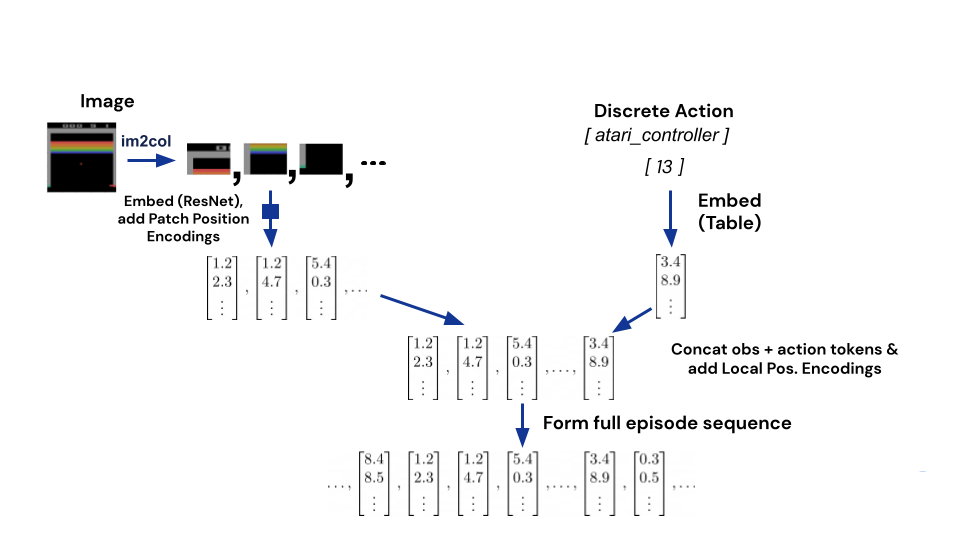
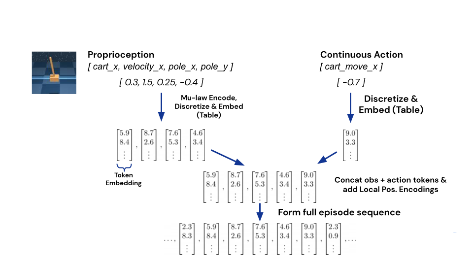
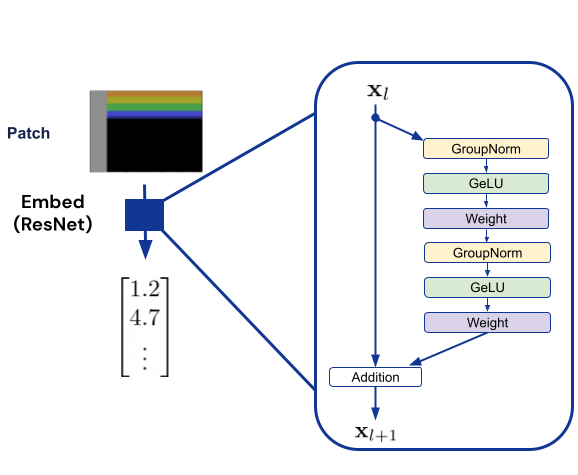
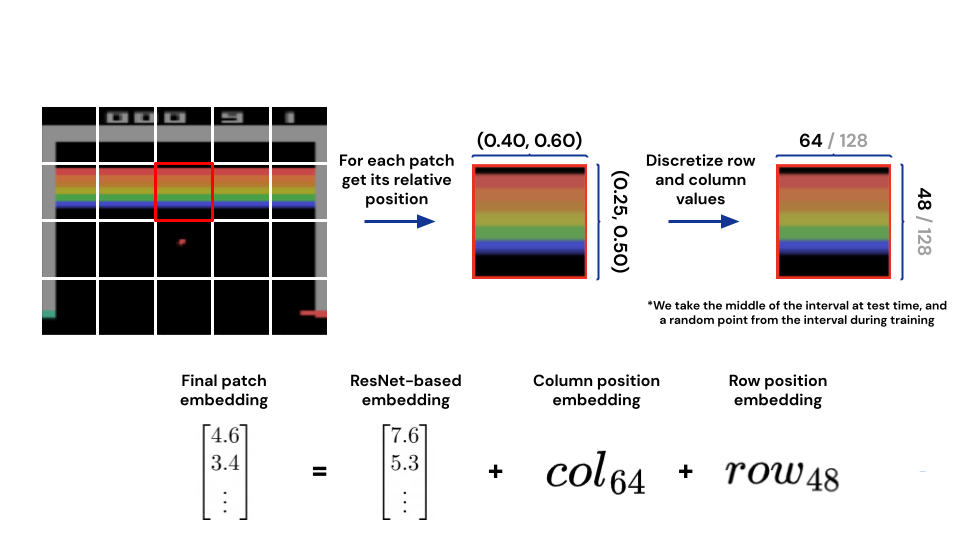

<a href="https://arxiv.org/abs/2205.06175">
  <h1 align="center">GATO: A Gernalist Agent</h1>
</a>

  Unofficial PyTorch implementation of GATO by DeepMind.

  <a href="#features"><strong>Features</strong></a> ·
  <a href="#how-to-use"><strong>How To Use</strong></a> ·
  <a href="#paper-review"><strong>Paper Review</strong></a>

 

# Features

TODO

# How to Use

TODO

# Paper Review

## Data Sources

TODO

## Tokenization

GATO processes all modalities as tokens.

- **Text:** Encoded via [SentencePiece](https://github.com/google/sentencepiece) as integers in the range [0, 32000), i.e. 32k vocab size.
- **Images:** Paritioned into 16x16 patches, sequenced in raster order (LtR top-down). Each patch is normalized into [-1,1] and divided by $\sqrt{16}$. See [ViT paper](https://arxiv.org/abs/2010.11929).
- **Discrete Values:** Flattened in row-major order and tokenized as a sequence of integers in the range [0, 1024).
- **Continuous Values:** Flattened in row-major order and mu-law encoded $$F(x) = \mathrm{sgn}(x) \frac{\log(|x|\mu + 1.0)}{\log(M\mu + 1.0)}$$, where $\mu=100$, $M=256$ (actions are excempt from companding). All values are clipped to [-1, 1] and then discretized into 1024 bins, uniformly spaced in the range [-1, 1]. Each bin is represented by an integer in the range [32000, 33024).

All tokens are then concatenated into a single sequence with the order $$s_{1:L} = \left[[y_{1:k}^1, x_{1:m}^1, z_{1:n}^1, '|', a_{1:A}^1], ..., [y_{1:k}^T, x_{1:m}^T, z_{1:n}^T, '|', a_{1:A}^T]\right]$$ where $y$ are text, $x$ image, $z$ tensor, and $a$ action tokens. The '|' token is used to separate observations from actions.

<table align="center">
  <tr>
    <td></td>
    <td></td>
  </tr>
  <tr>
    <td>Image & Discrete Tokenization</td>
    <td>Continuous Tokenization</td>
</table>

## Embedding

Each token is mapped into a learned embedding space of dimension 128 (or 32 for the 79M model) before being passed to the model. There are separate embeddings for images and the other modalities.

- **Text, Discrete, and Continuous tokens** are embedded with a parametrized lookup table $f(\cdot,\theta_e)$.
- **Image tokens** are embedded with a single ResNet block (v2 architecture) per patch.

## Positional Encoding

- **Text, Discrete, and Continuous tokens** are added with a learned 1D position encoding.
- **Image tokens** are added with a learned 2D position encoding. 

<table align="center">
  <tr>
    <td></td>
    <td></td>
  </tr>
  <tr>
    <td>Image Tokenization</td>
    <td>Image Positional Encoding</td>
  </tr>
</table>

## Model Architecture

TODO

## Training Recipe

TODO

## Evaluation

TODO
